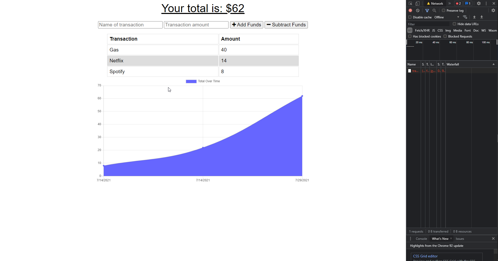
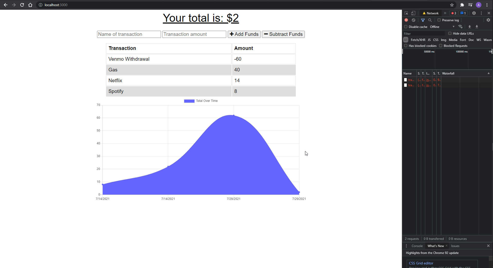

# Online/Offline Budget Tracker

## Description:
This application allows the use of offline and online interactions where the User may add withdrawals and deposists to their budget. This app aims to be a Progressive Web Application (PWA) where full functionality is present even when there is no internet connection.

## Link to deployed app on Heroku:

## User Story:
AS AN avid traveller
I WANT to be able to track my withdrawals and deposits with or without a data/internet connection
SO THAT my account balance is accurate when I am traveling

## Insallation Process:
* Clone the repository on your terminal
* Run npm install express
* Run npm morgan
* Run npm compression
* Run npm mongoose
* Run npm start
* Head to localhost:3000

## Screenshots:
Here, I am adding expenses to my budget while the Network is "offline" with the help of Chrome's dev tools.

Here, I am removing the expenses from my budget whilst offline.

## GitHub Repository:
https://github.com/aldwinlub/budget-tracker-offline-online